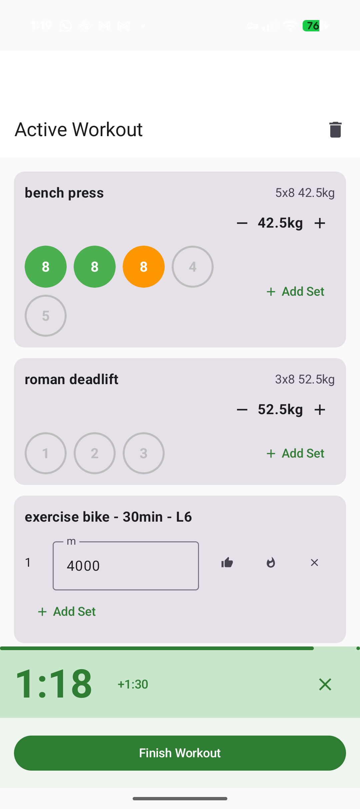
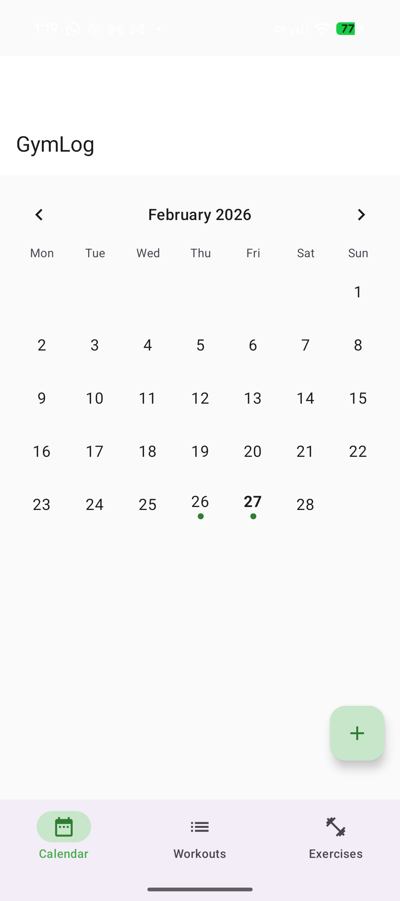

# GymLog

A simple, privacy-focused Android app for tracking your gym workouts. No accounts, no cloud, no tracking. Just you and your lifts.

GymLog lets you define exercises, build reusable workout templates, log sets in real time at the gym, and view your progress over time with charts and a calendar view.

## Screenshots

<p align="center">
  
  &nbsp;
  
  &nbsp;
  
  &nbsp;
  
</p>

## Features

### Exercise Library
Create and manage your personal exercise library. GymLog supports two exercise types:
- **Weight exercises** - bench press, squats, deadlifts, etc.
- **Cardio exercises** - rowing, running, cycling, etc.

### Workout Templates
Build reusable workout plans by combining exercises from your library. For each exercise in a template, set your targets:
- Number of sets
- Target reps and weight (for weight exercises)
- Target distance (for cardio exercises)

Templates save time so you can start a session with one tap instead of rebuilding your workout each time.

### Active Workout Tracking
Log your workout in real time as you train:
- **Quick weight adjustments** - +/- 2.5 kg buttons per set, plus "All sets" control to adjust every set at once
- **Rep tracking** - increment and decrement buttons for fast rep logging
- **Set status** - mark each set as Easy, Hard, or Failed
- **Add sets** - add extra sets on the fly if you want more than planned
- **Rest timer** - built-in 1:30 countdown timer with haptic feedback
- **Cardio logging** - fixed distance (track time in MM:SS) or fixed time (track distance in meters)

### Auto-Adjust Weight Suggestions
When you start a new session, GymLog suggests weights based on how your last session went:
- All sets easy recently? Weight goes up by 5% (minimum 2.5 kg)
- Sets were hard or you had failures? Weight stays the same or decreases
- Haven't trained in a while? Weight is reduced to account for detraining

### Calendar View
The home screen shows a monthly calendar with indicators on days you worked out. Tap any day to see your workout details for that session, including every set, rep count, weight, and status.

### Progress Charts
Select any exercise to see a line chart of your progression over time. The chart shows:
- Weight or distance trends across sessions
- Number of sessions logged
- Your most recent value
- Your personal best

### Resume Workouts
If you close the app mid-workout, GymLog saves your progress. When you come back, a banner on the home screen lets you pick up right where you left off.

## Getting Started

### 1. Add your exercises
Go to the **Exercises** tab and tap the + button. Give each exercise a name and choose whether it's a weight or cardio exercise.

### 2. Create a workout template
Go to the **Templates** tab and tap the + button. Name your template (e.g., "Push Day", "Full Body"), then add exercises from your library. Set target reps, weight, and number of sets for each exercise.

### 3. Start a workout
From the **Calendar** tab, tap the + button to start a new workout. Pick a template, and GymLog loads your exercises with targets pre-filled. If you've done the exercise before, it auto-fills your last weight.

### 4. Log your sets
As you train, update the weight and reps for each set. Tap Easy, Hard, or Fail to mark each set. Use the rest timer between sets.

### 5. Finish and review
Tap "Finish Workout" when you're done. Your session is saved and visible on the calendar. Check the progress chart for any exercise to see how you're improving over time.

## Privacy

GymLog is designed with privacy as a core principle:

- **No internet access** - the app requests zero network permissions
- **No accounts** - there is nothing to sign up for
- **No analytics or tracking** - no data leaves your device
- **No cloud sync** - all data is stored locally in an on-device database
- **No ads** - the app is completely free with no monetization
- **Backup disabled** - `android:allowBackup` is set to false so your workout data is not included in Android cloud backups

Your data stays on your device, period.

## Installation

### GitHub Releases (sideload)

1. Go to the [Releases](https://github.com/dcmcand/gymlog/releases) page and download the latest `app-release.apk`
2. On your Android device, open **Settings > Apps > Special app access > Install unknown apps** and allow your browser or file manager to install APKs
3. Open the downloaded APK and tap **Install**
4. Once installed, you can revoke the "Install unknown apps" permission if you prefer

### F-Droid
_Coming soon_

### Build from source
See [Building from Source](#building-from-source) below.

## Requirements

- Android 12 or newer (API level 31+)

## Building from Source

### Prerequisites
- JDK 21 (Temurin recommended)
- Android SDK with API level 36
- Android Build Tools

### Build the debug APK

```bash
git clone https://github.com/dcmcand/gymlog.git
cd gymlog
./gradlew assembleDebug
```

The APK will be at `app/build/outputs/apk/debug/app-debug.apk`. Transfer it to your device and install.

### Build the release APK

```bash
./gradlew assembleRelease
```

Note: release builds need to be signed before installation. See the [Android signing documentation](https://developer.android.com/studio/publish/app-signing) for details.

### Run tests

```bash
./gradlew test
```

## Tech Stack

- **Language**: Kotlin
- **UI**: Jetpack Compose with Material 3
- **Database**: Room (local SQLite)
- **Navigation**: Compose Navigation
- **Charts**: Vico
- **Min SDK**: 31 (Android 12)
- **Target SDK**: 36 (Android 15)

## Contributing

See [CONTRIBUTING.md](CONTRIBUTING.md) for development setup and guidelines.

## License

GymLog is open source under the [MIT License](LICENSE).
